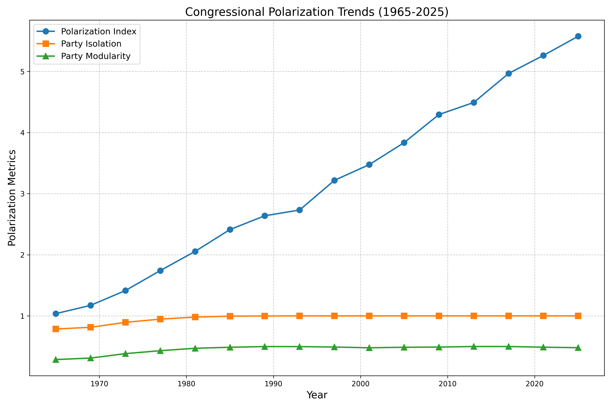

# Congressional Polarization Analysis

This project analyzes and visualizes polarization in the United States Congress, with a focus on the 119th Congress (2025-2026) and historical trends. It generates visualizations similar to the example provided, showing the increasing polarization between parties over time.

## Features

- **Current Congress Analysis**: Detailed analysis of the 119th Congress, including network visualizations of voting patterns for both the House and Senate.
- **Historical Trends**: Visualization of polarization from 1965 to 2025, showing how the political landscape has evolved over time.
- **Polarization Metrics**: Calculates and visualizes various metrics of congressional polarization, including party cohesion, inter-party distance, and modularity.
- **Network Visualization**: Creates network graphs where nodes represent members of Congress and edges represent voting similarities.

## Installation

1. Clone this repository:
```bash
git clone https://github.com/yourusername/congressional-polarization.git
cd congressional-polarization
```

2. Create a virtual environment and install dependencies:
```bash
python -m venv venv
source venv/bin/activate  # On Windows, use: venv\Scripts\activate
pip install -r requirements.txt
```

## Usage

### Basic Usage

Run the full analysis with default settings:

```bash
python main.py
```

This will:
1. Analyze the current 119th Congress
2. Generate historical visualizations from 1965-2025
3. Analyze recent congresses (100th-119th)
4. Create a comprehensive visualization combining all analyses

### Command Line Options

```
usage: main.py [-h] [--output OUTPUT] [--current-only] [--historical-only] [--recent-only]
               [--start-year START_YEAR] [--end-year END_YEAR]
               [--start-congress START_CONGRESS] [--end-congress END_CONGRESS]

options:
  -h, --help            show this help message and exit
  --output OUTPUT       Output directory for results
  --current-only        Only analyze current Congress
  --historical-only     Only analyze historical trends
  --recent-only         Only analyze recent Congresses
  --start-year START_YEAR
                        Start year for historical analysis
  --end-year END_YEAR   End year for historical analysis
  --start-congress START_CONGRESS
                        Start Congress for recent analysis
  --end-congress END_CONGRESS
                        End Congress for recent analysis
```

### Examples

Analyze only the current 119th Congress:
```bash
python main.py --current-only
```

Analyze historical trends from 1980 to 2025:
```bash
python main.py --historical-only --start-year 1980 --end-year 2025
```

Analyze only recent congresses (110th-119th):
```bash
python main.py --recent-only --start-congress 110 --end-congress 119
```

## Project Structure

- `main.py`: Main script to run the analysis
- `congressional_polarization.py`: Contains the `CongressionalPolarizationAnalyzer` class for analyzing the current Congress
- `historical_polarization.py`: Contains the `HistoricalPolarizationAnalyzer` class for analyzing historical trends
- `results/`: Directory where all visualizations and data are saved
  - `congress_119/`: Analysis of the 119th Congress
  - `historical/`: Historical trend analysis
  - `recent_congresses/`: Analysis of recent congresses

## Data Sources

The project currently uses simulated data for demonstration purposes. In a production environment, it could be connected to real congressional voting data from sources such as:
- [ProPublica Congress API](https://projects.propublica.org/api-docs/congress-api/)
- [GovInfo](https://www.govinfo.gov/app/collection/chrg)
- [Voteview](https://voteview.com/data)

## Visualization Examples

### Network Visualization


The visualization shows members of Congress as nodes (blue for Democrats, red for Republicans) with connections representing voting similarity. Over time, the parties become more clearly separated, indicating increased polarization.

### Polarization Trends


This chart shows how polarization metrics have increased over time, with a sharp rise in recent decades.

## Requirements

- Python 3.8+
- NumPy
- Pandas
- Matplotlib
- NetworkX
- scikit-learn
- Seaborn
- tqdm

## Future Improvements

- I need more integration with real congressional voting data
- Sentiment analysis of congressional speeches
- Analysis of specific policy areas and how polarization varies